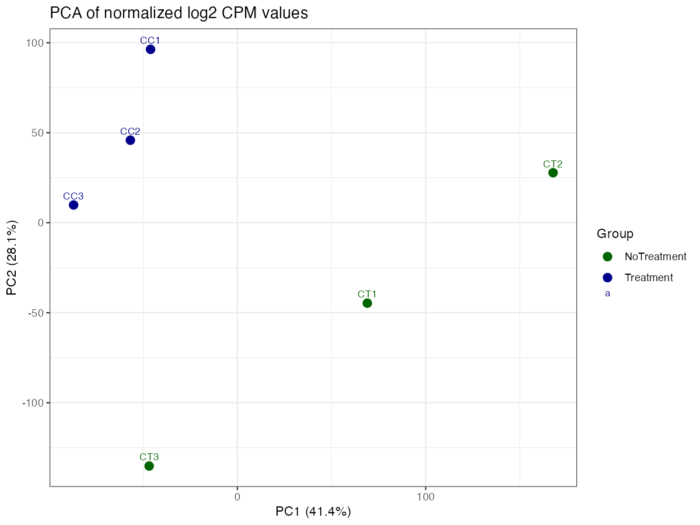
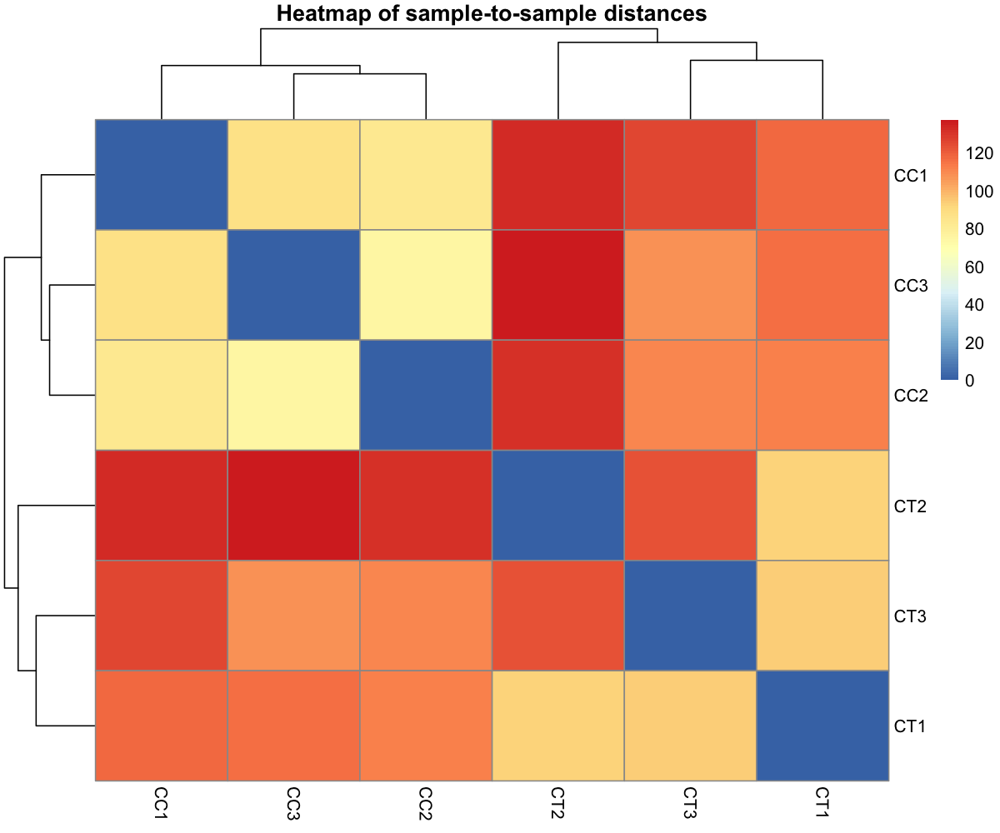
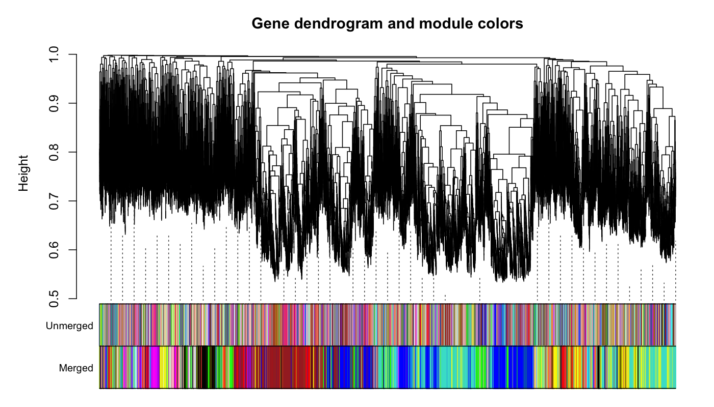
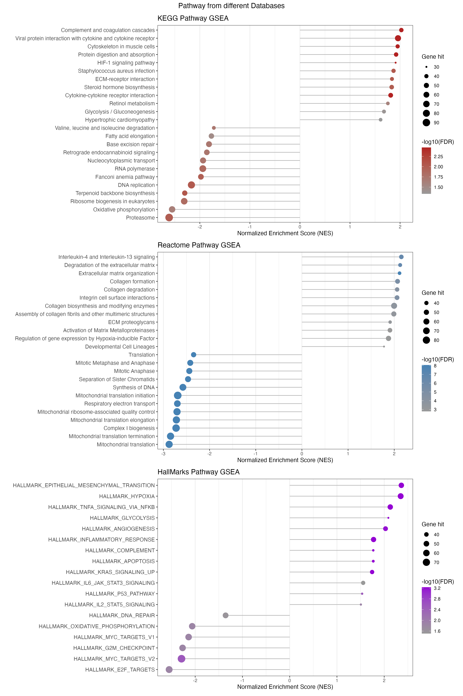
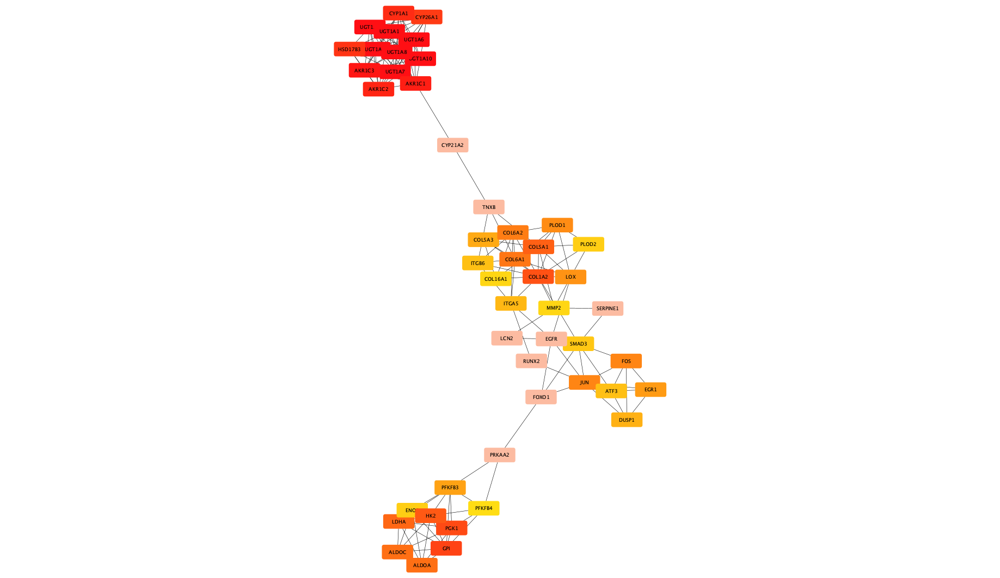

# RNA-seq Analysis of MCF-7 Cells Cocultured with ADSCs

   

------------------------------------------------------------------------

## Introduction

This project presents a complete and reproducible RNA-seq analysis workflow developed to replicate and validate the findings of the referenced study.

The analysis focuses on identifying gene expression changes in MCF-7 breast cancer cells cocultured with adipose-derived stem cells (ADSCs), providing insights into early mechanisms of cancer progression.

------------------------------------------------------------------------

# 🧬 Biological Context

This project is based on the study:\
*“Integrated RNA Sequencing Analysis Revealed Early Gene Expression Shifts Associated with Cancer Progression in MCF-7 Breast Cancer Cells Cocultured with Adipose-Derived Stem Cells”*.

Breast cancer progression is strongly influenced by the **tumor microenvironment (TME)**, where stromal cells such as **adipose-derived stem cells (ADSCs)** play a key role in modulating cancer cell behavior.

In this study, the authors investigated how **coculture with ADSCs** affects the transcriptomic profile of **MCF-7 breast cancer cells**, focusing on early gene expression changes associated with tumor progression.

**Key biological insights from the original study include:**

-   ADSCs induce **early transcriptional reprogramming** in cancer cells
-   Activation of pathways related to:
    -   **cell proliferation**
    -   **migration and invasion**
    -   **extracellular matrix (ECM) remodeling**
-   Modulation of signaling pathways commonly associated with cancer progression, including:
    -   **PI3K-Akt signaling**
    -   **MAPK signaling**
    -   **inflammatory and cytokine-mediated pathways**

These findings suggest that ADSCs may promote a **pro-tumorigenic phenotype** in breast cancer cells even at early stages of interaction.

------------------------------------------------------------------------

# 🔬 Objective of This Project

The goal of this project is to **reproduce and validate** the main findings of the study through a complete bulk RNA-seq analysis pipeline, including:

-   Differential gene expression analysis
-   Functional enrichment (**GO, KEGG, Reactome, Hallmarks**)
-   Network analysis (**PPI and hub gene identification**)

By replicating the analysis, this project aims to:

-   Verify the **robustness and reproducibility** of the published results
-   Identify **key genes and pathways** involved in early tumor progression
-   Provide a **transparent and reusable RNA-seq workflow**

------------------------------------------------------------------------

# 🌟 Highlight

Overall, this analysis highlights how **stromal–tumor interactions** can drive early molecular changes that may contribute to breast cancer progression, emphasizing the importance of the **tumor microenvironment** in cancer biology.

------------------------------------------------------------------------

## Key Features

-   End-to-end RNA-seq workflow (from raw FASTQ to biological interpretation)
-   Reproducible statistical analysis following Bioconductor best practices
-   Differential expression analysis using edgeR (TMM normalization)
-   Network analysis with WGCNA for module detection
-   Functional enrichment analysis (ORA and GSEA)
-   PPI network construction and hub gene identification (STRING + Cytoscape)
-   Integration with clinical survival data (GEO dataset)

------------------------------------------------------------------------

## Experimental Design

The experiment consists of **6 RNA-seq samples**, with 3 biological replicates per condition:

| Condition | Number of Replicates | Description                       |
|-----------|----------------------|-----------------------------------|
| Control   | 3                    | MCF-7 cells cultured alone        |
| Treatment | 3                    | MCF-7 cells cocultured with ADSCs |

------------------------------------------------------------------------

## Dataset

-   **BioProject:** [PRJNA1161137](https://www.ncbi.nlm.nih.gov/bioproject/PRJNA1161137)\
-   **Data type:** RNA-seq, FASTQ files\
-   **Number of samples and conditions:** see table above\
-   **Additional dataset for survival analysis:** GSE2034 from GEO (analysis not completed due to lack of GDC access)

------------------------------------------------------------------------

## 📁 GitHub Repository Structure

``` text
Bulk-RNA-Seq-pipeline(edgeR)/
├── README.Rmd
├── README.md
├── upstream/
│   ├── report/
│   │   ├── featureCounts/
│   │   ├── MultiQC/
│   │   └── Trimmomatic/
│   └── script
│
├── downstream/
│   ├── Cytoscape/
│   │   ├── common_genes_STRING.txt
│   │   ├── Hub_genes.png
│   │   ├── MCC_Value.csv
│   │   ├── MCC_ValueClean.csv
│   │   ├── PPI_Network.cys
│   │   ├── string_interactions_short.tsv
│   ├── objects/
│   │   ├── Background_genes.rds
│   │   ├── CommonGenes.rds
│   │   ├── ExactTestDEG.rds
│   │   ├── genes_ME_brown.rds
│   │   ├── logCPM_counts.rds
│   │   ├── ResFromExactTest.rds
│   ├── R-scripts/
│   │   ├── 01-ExactTest.R
│   │   ├── 02-WGCNA.R
│   │   ├── 03-ORA.R
│   │   ├── 04-GSEA.R
│   │   ├── 05-PPI.R
│   │   └── 06-Disease-Free-SurvivalAnalysis.R
│   └── plots/
│       ├── ExactTest/
│       ├── GSEA/
│       ├── ORA/
│       ├── PPI/
│       ├── Survival/
│       ├── WGCNA
```

------------------------------------------------------------------------

## Analysis Pipeline

### Upstream (Preprocessing)

1.  **Data download** from SRA\
2.  **Read quality control:** FastQC + MultiQC\
3.  **Adapter trimming:** Trimmomatic\
4.  **Second quality check:** FastQC + MultiQC\
5.  **Alignment:** HISAT2\
6.  **Quantification:** featureCounts

------------------------------------------------------------------------

### Downstream (Statistical and Biological Analysis)

1.  **Differential Expression Analysis:** edgeR (TMM normalization and exact test for differential expression)\
2.  **Gene clustering:** WGCNA\
3.  **Functional Enrichment (ORA):** GO, KEGG, Reactome\
4.  **Gene Set Enrichment Analysis (GSEA):** GO, KEGG, Reactome, Hallmarks\
5.  **Protein-Protein Interaction (PPI):** STRING database for interaction retrieval, network visualization and hub gene identification performed in Cytoscape using cytoHubba (MCC algorithm)\
6.  **Survival Analysis:** GSE2034 dataset, not completed due to GDC access limitations

------------------------------------------------------------------------

## Main Results

-   **PCA and sample-to-sample Heatmap**\





-   **Heatmaps of DEGs**\

\

-   **Volcano plots with log2FC and FDR**\

\

-   **Dendrogram of modules from WGCNA**\



-   **GSEA: significant pathways in GO, KEGG, Reactome, Hallmarks**\




-   **PPI network and identification of hub genes**\



-   **Expression of Top Hub Genes Stratified by ER Status and Relapse**\


------------------------------------------------------------------------

## Reproducibility

All analyses were performed in R.\
Session information (R version and package versions) is provided to ensure reproducibility.

Scripts are organized in a structured, step-by-step workflow and can be executed sequentially without manual intervention.

Environment reproducibility can be further improved using tools such as renv.

------------------------------------------------------------------------

## How to Run the Analysis

1.  Download raw data from SRA (PRJNA1161137)
2.  Run upstream preprocessing scripts
3.  Run downstream analysis scripts in order:

-   01-ExactTest.R
-   02-WGCNA.R
-   03-ORA.R
-   04-GSEA.R
-   05-PPI.R
-   06-Disease-Free-SurvivalAnalysis.R

4.  Results will be saved in the `downstream/plots/` directory

------------------------------------------------------------------------

## Conclusions

-   The workflow was **successfully replicated** compared to the original paper, confirming result robustness.

-   Limitations: survival analysis could not be completed due to lack of GDC access.

-   This project demonstrates my ability to design and implement a complete RNA-seq analysis workflow, from raw data processing to biological interpretation.

-   The analysis follows established bioinformatics best practices and ensures reproducibility, making it suitable for both research and applied bioinformatics contexts.\

------------------------------------------------------------------------

## References

1.  **Original paper:**\
    Integrated RNA Sequencing Analysis Revealed Early Gene Expression Shifts Associated with Cancer Progression in MCF-7 Breast Cancer Cells Cocultured with Adipose-Derived Stem Cells, *Curr. Issues Mol. Biol.*, 2023, DOI: [10.3390/cimb46110702](https://doi.org/10.3390/cimb46110702)\
2.  **GEO dataset:** [GSE2034](https://www.ncbi.nlm.nih.gov/geo/query/acc.cgi?acc=GSE2034)\
3.  **BioProject:** [PRJNA1161137](https://www.ncbi.nlm.nih.gov/bioproject/PRJNA1161137)\
4.  **RNA-seq best practices:** [Bioconductor RNA-seq workflow](https://www.bioconductor.org/help/workflows/rnaseqGene/)

## Tools

1.  **R** (v.4.5.1)
2.  **Bioconductor packages:** edgeR (v4.8.2), WGCNA (v1.74), clusterProfiler (v4.18.4), ReactomePA (v1.54.0), fgsea (v1.36.2)\
3.  **PPI tools:**
    -   STRING v12.0: protein–protein interaction database
    -   Cytoscape v3.10.4: network visualization platform
    -   cytoHubba plugin: hub gene identification (MCC algorithm)
4.  **Additional tools**:
    -   HISAT2 (alignment)
    -   featureCounts (quantification)
    -   FastQC / MultiQC (quality control)
    -   Trimmomatic (remove adapters)

------------------------------------------------------------------------

# 📄 License

This project is licensed under the MIT License. See the [LICENSE](LICENSE) file for details.
